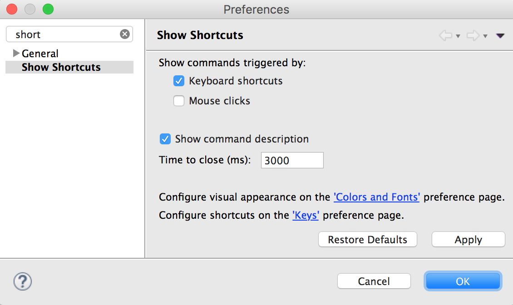

This is a handy Eclipse plugin that shows the currently pressed keyboard shortcut in a small popup along with the shortcut description.
It's useful if you want to make clear to others which shortcut you have just pressed, e.g. in demo or pair-programming situations. 

## Install
  Use this URL to install it in Eclipse using _Help -> Install New Software_:

`
https://chgeo.github.io/show-shortcuts
`

## Usage<
Whenever you use a keyboard shortcut in Eclipse, this small dialog will show up:

## Configuration
By default the plugin is enabled. This is how you configure it:

